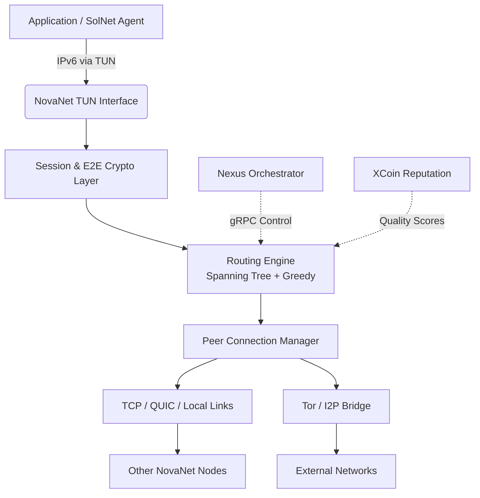

# NovaNet v0.1 Technical Specification

**Version:** 0.1.0-draft  
**Date:** 12 June 2026  
**Status:** Draft for Review  
**Authors:** Sven Normen Esslinger (Esslinger & Co. / Aurora Project)  
**License:** MIT (see LICENSE in Aurora Project repository)  
**Related Documents:**  
- [Aurora Project Vision](https://github.com/digitaldesignerjazz/aurora-project/blob/main/VISION.md)  
- [Aurora Project Whitepaper](https://github.com/digitaldesignerjazz/aurora-project/blob/main/WHITEPAPER.md)  
- [Aurora Project Roadmap](https://github.com/digitaldesignerjazz/aurora-project/blob/main/ROADMAP.md)  

---

## 1. Executive Summary

NovaNet is a **sovereign, privacy-first, resilient mesh networking protocol** designed as the foundational connectivity layer for the Aurora ecosystem (NovaNet + SolNet + XCoin + Nexus).

**NovaNet v0.1** delivers the minimal viable core for a decentralized IPv6-capable overlay/mesh network. It is heavily inspired by the Yggdrasil compact routing scheme but simplified and extended for:

- Strong metadata resistance and privacy defaults
- Easy deployment via Docker and consumer hardware (Tenda Nova mesh Wi-Fi systems)
- Native bridge support to Tor and I2P
- Clean integration hooks for AI agent swarms (SolNet), cryptoeconomic incentives (XCoin), and cross-layer orchestration (Nexus)

**v0.1 Goals:**
- Bootstrappable single-binary or Docker node (`novanetd`)
- Functional mesh among 10–500 nodes with acceptable latency
- End-to-end encrypted transport
- TUN-based virtual IPv6 interface for transparent application use
- Local peer discovery + bootstrap node support
- Basic Tor/I2P bridge functionality
- Management API and CLI
- Reference implementation in Rust (memory safety + performance)

**Non-Goals for v0.1:**
- Full SolNet AI swarm routing / agent mobility
- Production XCoin staking or on-mesh micropayments
- Advanced mixnet / traffic analysis resistance (deferred to v0.3+)
- Mobile / embedded client optimizations
- Global-scale performance tuning

---

## 2. Design Philosophy & Principles

NovaNet follows the Aurora principles:

1. **Sovereignty First** — Every node is equal. No trusted root CA, no mandatory bootstrap hierarchy.
2. **Privacy by Default** — All traffic is encrypted. Node identity is cryptographic. Minimal metadata leakage.
3. **Resilience & Self-Healing** — Network continues to function under partition, node failure, or infrastructure collapse.
4. **Simplicity & Auditability** — v0.1 prioritizes a small, reviewable codebase over maximal features.
5. **Extensibility for Aurora Layers** — Clean interfaces for Nexus messaging, SolNet agent coordination, and XCoin incentives.
6. **Hardware Pragmatism** — Excellent support for real-world mesh hardware (Tenda Nova, GL.iNet, etc.) and Docker/K8s environments.

---

## 3. High-Level Architecture

### 3.1 Node Components

```
+-----------------------------+
|        Application Layer    |  (apps, SolNet agents, Nexus services)
+-----------------------------+
|      TUN / Socket Interface |  (virtual IPv6 network device)
+-----------------------------+
|        NovaNet Core         |
|  - Routing Engine           |
|  - Crypto Session Manager   |
|  - Peer / Connection Mgr    |
|  - Discovery Subsystem      |
+-----------------------------+
|     Link / Transport Layer  |  (TCP, UDP, QUIC future, local Wi-Fi/Bluetooth)
+-----------------------------+
|     Bridge / Exit Layer     |  (Tor, I2P, clearnet egress with policy)
+-----------------------------+
```

### 3.2 Network Model (v0.1)

NovaNet v0.1 uses a **hybrid spanning-tree + greedy routing** model inspired by Yggdrasil:

- A **self-organizing spanning tree** provides synchronization and initial coordinate assignment.
- Each node is identified by its **Ed25519 public key** (NodeID = BLAKE3(pubkey) or direct pubkey use).
- Nodes are assigned **tree coordinates** (variable-length path from current tree root — the node with the lexicographically smallest NodeID in the connected component).
- **Bloom filters** are exchanged along tree edges to summarize reachable keyspace (for efficient lookup culling).
- **Greedy routing**: When forwarding, a node chooses the peer whose coordinates bring the packet closest to the destination (in tree distance metric).
- **Opportunistic path improvement**: Nodes can establish direct "shortcut" sessions when beneficial (similar to Yggdrasil path setup).

This gives good scalability for hundreds of nodes while remaining simple to implement in v0.1.

For larger scales or lower latency, v0.2+ will add:
- Hyperbolic / latency-aware embedding
- XCoin-staked high-quality routers
- SolNet-assisted predictive routing

### 3.3 Addressing

- **Node Identity**: Ed25519 keypair. NodeID = first 256 bits of BLAKE3(pubkey) or full pubkey.
- **Network Address**: Each node auto-assigns itself one or more IPv6 addresses from a Unique Local Address (ULA) prefix `fd00:dead:beef::/48` (or configurable). Address = prefix + NodeID-derived suffix.
- Applications see a normal IPv6 network via the TUN device. No NAT.

---

## 4. Protocol Details (v0.1)

### 4.1 Wire Format

All messages are **length-prefixed** (u32 BE) + **type** (u8) + payload.

Core message types (initial set):

| Type | Name              | Description |
|------|-------------------|-----------|
| 0x01 | `Ping`            | Keepalive + latency measurement |
| 0x02 | `Pong`            | Response to Ping |
| 0x03 | `TreeAnnounce`    | Announce tree coordinates + bloom filter update |
| 0x04 | `RouteUpdate`     | Share routing information / shortcuts |
| 0x05 | `Data`            | Encapsulated user payload (with session ID) |
| 0x06 | `PathSetup`       | Request/establish optimized path |
| 0x07 | `BridgeAnnounce`  | Announce Tor/I2P bridge capability |
| 0x08 | `NexusMessage`    | Encapsulated Nexus control / agent message (v0.1 stub) |

### 4.2 Cryptographic Handshake

- Peering uses **Noise Protocol Framework** (Noise_XX_25519_ChaChaPoly_BLAKE2s or similar modern variant).
- Provides mutual authentication (via Ed25519), forward secrecy, and session keys.
- After handshake, all traffic on the link is encrypted.
- End-to-end encryption for user data is provided at the session layer (separate from link encryption).

### 4.3 Session & Forwarding

- User traffic is encapsulated with a **session header** containing destination NodeID + sequence + flags.
- Intermediate nodes perform **greedy forwarding** based on current tree coordinates + bloom filter knowledge.
- When a node has no better route, it falls back to tree routing toward the root direction.

---

## 5. Peer Discovery & Connection Management

### 5.1 Local Discovery (v0.1)

- mDNS / DNS-SD on link-local: `_novanet._tcp.local.`
- Bluetooth Low Energy (BLE) advertisement (optional, for mobile/IoT)
- Wi-Fi Aware / NAN where hardware supports (future)

### 5.2 Global / Bootstrap

- Hardcoded + configurable bootstrap node list (multiaddr style, e.g. `tcp://bootstrap1.novanet.aurora:11911`)
- Later: XCoin-registered "well-known" routers with stake proof (v0.2)

### 5.3 Connection Policy

- Nodes maintain a **connection table** with quality metrics (latency, packet loss, uptime).
- Preference for:
  1. Direct local peers (lowest latency)
  2. High-quality long-distance peers
  3. Bridge nodes for external connectivity

---

## 6. Bridge & Exit Layer

NovaNet v0.1 includes first-class support for **privacy-preserving bridges**:

- **Tor Bridge Mode**: Node can expose itself as a Tor hidden service (`.onion`) and accept incoming peerings over Tor.
- **I2P Bridge Mode**: Similar for I2P (base32 `.b32.i2p` addresses).
- **Clearnet Egress**: Controlled exit nodes with rate limiting, geo-fencing, and logging policy (for users who want reachability to the classic internet).
- **Ingress Filtering**: Strict allow-list or reputation-based for bridge connections.

This enables nodes behind CGNAT or restrictive firewalls to participate fully.

---

## 7. Deployment & Hardware Integration

### 7.1 Docker (Primary v0.1 Target)

Official multi-arch images:
- `ghcr.io/aurora-project/novanetd:v0.1`
- Includes `novanetd`, `novanetctl`, and example `docker-compose.yml` for test clusters.

Example compose:
```yaml
services:
  novanet:
    image: ghcr.io/aurora-project/novanetd:v0.1
    cap_add: [NET_ADMIN]
    devices:
      - /dev/net/tun
    volumes:
      - ./config:/etc/novanet
      - ./data:/var/lib/novanet
    sysctls:
      - net.ipv6.conf.all.forwarding=1
```

### 7.2 Tenda Nova & Consumer Mesh Hardware

- NovaNet can run as a container or native binary on OpenWrt-based systems (Tenda Nova, GL.iNet, etc.).
- v0.1 provides basic integration scripts for:
  - Wi-Fi interface monitoring
  - Automatic peering over 802.11s or batman-adv where available (future tighter integration)
  - Status export to local dashboard

### 7.3 Configuration

TOML-based config at `/etc/novanet/novanet.toml`:

```toml
[node]
name = "sven-hannover-01"
private_key_path = "/var/lib/novanet/keys/ed25519.key"

[network]
ula_prefix = "fd00:dead:beef::/48"
mtu = 1280

[peering]
listen = ["tcp://0.0.0.0:11911", "quic://0.0.0.0:11912"]
bootstrap = [
    "tcp://bootstrap1.aurora.novanet:11911",
    "tcp://[2001:db8::1]:11911"
]

[bridges]
tor_enabled = true
i2p_enabled = false
clearnet_egress = false

[integrations]
nexus_endpoint = "grpc://127.0.0.1:50051"
xcoin_stub = true
```

---

## 8. Integration with Aurora Layers (v0.1 Stubs)

| Layer   | Integration Point                  | v0.1 Status          | Notes |
|---------|------------------------------------|----------------------|-------|
| **Nexus**   | gRPC / message bus for control & agent coordination | Stub + basic message type | Full agent swarm routing in v0.2 |
| **SolNet**  | Agent identity + routing hints     | Read-only NodeID exposure | Predictive routing + agent mobility v0.3+ |
| **XCoin**   | Peer reputation / quality scoring  | Local metrics only   | Staking for priority routing v0.2 |

---

## 9. APIs & Tooling

### 9.1 Management API

- HTTP/JSON + gRPC (preferred) on `127.0.0.1:11910`
- Endpoints (initial):
  - `GET /v1/status`
  - `GET /v1/peers`
  - `POST /v1/connect`
  - `GET /v1/routes`
  - `GET /v1/bridges`

### 9.2 CLI (`novanetctl`)

```bash
novanetctl status
novanetctl peers --sort latency
novanetctl connect tcp://1.2.3.4:11911
novanetctl route --to <NodeID>
novanetctl bridge enable tor
```

### 9.3 TUN Device & Application Use

After starting `novanetd`, a TUN interface `nova0` appears. Applications can bind to the assigned IPv6 addresses or use the interface directly. No special SDK required for basic use.

---

## 10. Implementation Recommendations (v0.1)

**Recommended Stack (Rust):**

- **Async runtime**: Tokio
- **Crypto**: `ed25519-dalek`, `snow` (Noise), `chacha20poly1305`, `blake3`
- **Networking**: `quinn` (QUIC future), `tokio-tungstenite` or raw TCP + `noise`
- **TUN**: `tun2` or `tokio-tun` crate
- **mDNS**: `mdns-sd` or `libmdns`
- **Config**: `figment` + TOML
- **CLI**: `clap` v4
- **Bloom filters**: `fastbloom` or simple bitvec implementation

**Alternative for rapid prototyping**: Go (easier cross-platform TUN) or even Python + Scapy for simulation.

**Repository Structure Suggestion** (to be added under `aurora-project/novanet/`):

```
novanet/
├── Cargo.toml
├── src/
│   ├── main.rs
│   ├── node/
│   ├── routing/
│   ├── crypto/
│   ├── discovery/
│   └── bridge/
├── docs/
├── docker/
├── tests/
└── README.md
```

---

## 11. Security Considerations & Threat Model

**Assumptions (v0.1):**
- Nodes are not compromised at OS level.
- Bootstrap nodes are honest-but-curious (they see connection metadata but not content).
- Physical layer attacks (jamming, evil twin Wi-Fi) are out of scope or mitigated by hardware choice.

**Threats Mitigated:**
- Passive global adversary (traffic analysis) — partial (link encryption + padding stubs)
- Active MITM on peering links — fully mitigated by Noise handshake
- Sybil attacks — rate-limited new peer acceptance + future XCoin cost
- Eclipse attacks — multiple bootstrap + diverse peer selection

**Known Limitations in v0.1:**
- No cover traffic / constant-rate sending (expensive)
- Tree root is predictable (lowest NodeID) — can be rotated in later versions
- Bloom filter false positives can cause minor extra traffic

**Audit Priority:** Crypto handshake, routing logic, and TUN device handling.

---

## 12. Testing & Validation

- **Unit tests**: Routing table logic, bloom filter operations, coordinate math
- **Integration tests**: Docker Compose multi-node mesh (5–20 nodes)
- **Simulation**: Custom Rust simulator or use of `netsim` / `shadow` for larger scale
- **Testnet**: Public bootstrap nodes operated by Aurora Project + community call for early adopters
- **Hardware test**: Tenda Nova cluster in Hannover lab + remote nodes

Success metrics for v0.1:
- 50+ node stable mesh with < 200ms median latency on good links
- Successful Tor/I2P bridge peering
- TUN interface passes iperf3 and basic web traffic
- Clean shutdown and recovery after partition

---

## 13. Roadmap Alignment

See full [ROADMAP.md](https://github.com/digitaldesignerjazz/aurora-project/blob/main/ROADMAP.md).

**v0.1 (Q2 2026)**: Core mesh + Docker + basic bridges (this spec)  
**v0.2 (Q3 2026)**: Nexus integration, XCoin reputation, improved routing, QUIC transport  
**v0.3 (Q4 2026)**: SolNet agent-native routing, basic mixnet features, mobile client prototype  
**v1.0 (2027)**: Production hardening, formal verification of critical paths, global testnet growth

---

## 14. Open Questions & Future Considerations

1. Should NovaNet adopt a full Yggdrasil-compatible wire protocol in v0.2 for interoperability with existing Yggdrasil nodes?
2. Optimal coordinate system for combined tree + latency + XCoin-quality metric?
3. How to handle IPv4-only legacy applications gracefully (Teredo-like or proxy)?
4. Governance of bootstrap node list and bridge policies (Nexus lightweight voting?).

---

## Appendix A: Example Message (Conceptual)

```rust
// Pseudocode / high-level
enum Message {
    Ping { nonce: u64, timestamp: u64 },
    Pong { nonce: u64, timestamp: u64, latency_ms: u16 },
    TreeAnnounce {
        node_id: [u8; 32],
        tree_coords: Vec<u8>,
        bloom_filter: Vec<u8>,
        seq: u64,
    },
    Data {
        session_id: u64,
        dst_node_id: [u8; 32],
        payload: Vec<u8>,
        flags: u8,
    },
}
```

---

## Appendix B: Mermaid Architecture Diagram



---

**End of NovaNet v0.1 Technical Specification**

*This document is a living draft. Feedback, corrections, and contributions are welcome via GitHub issues or pull requests on the Aurora Project repository.*

**Next immediate actions recommended:**
1. Review and comment on this spec
2. Scaffold the Rust `novanetd` skeleton (done — see novanetd/ directory)
3. Stand up initial Docker test cluster (see docker/novanet-test-cluster/)
4. Define exact wire protocol binary format (done — see specs/novanet-wire-protocol-v0.1.md)

Sven, the mesh has its first detailed blueprint.

Ready when you are. 🚀

---

*Document generated for the Aurora Project – 12 June 2026*